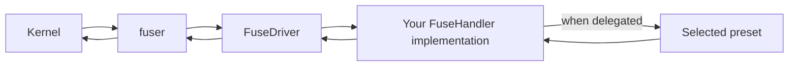
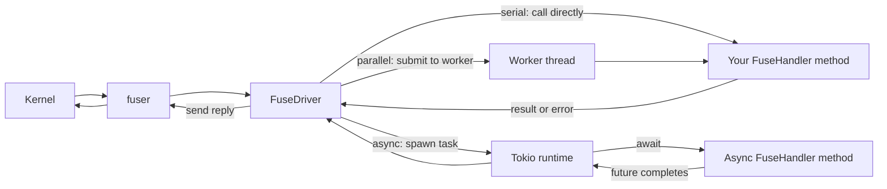
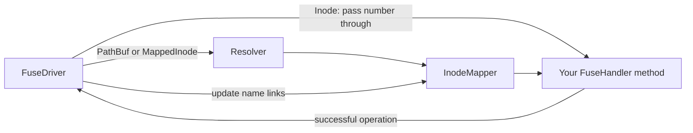

# Contributing

This guide explains how to propose changes, how the crate works, and how to check your work.

## 1. Contribution rules

### Changes

Bug fixes, documentation, examples, and focused improvements are welcome. Explain the problem your change solves.

Core API changes are likely to be rejected. This includes changes to `FuseHandler`, file IDs, file handles, mount functions, or delegation macros. If a breaking change seems necessary, explain why, list its effects, and discuss it before doing a large implementation.

Changes should be clear and small enough to review. Avoid unrelated edits. Update the docs and changelog when user-visible behavior changes.

### AI tools

You may use AI tools for any part of your work. Before opening a PR, check the result yourself. The maintainer must be able to understand the code and its side effects. Be ready to explain the important choices.

### Pull requests

Include these points in your PR:

1. What problem does it solve?
2. What did you change? Does it change the public API or user-visible behavior?
3. What checks did you run? List anything you could not run and why.
4. Which docs or changelog entries did you update?

For a bug fix, include a short way to reproduce the bug when possible. For performance work, include measurements. Keep each PR focused.

### Crate releases

If you want a change released, ask for a release in its PR. The `devel` branch holds work for a future release; `main` holds published code. Releases follow [Semantic Versioning](https://semver.org/) and each release has a Git tag.

## 2. Project guide

### Dictionary

- **FUSE**: A system that sends filesystem requests from the kernel to a program.
- **`fuser`**: The Rust crate that connects this project to the operating system's FUSE system.
- **Callback**: A handler method the driver calls for one filesystem operation, such as `read` or `lookup`.
- **Handler (`FuseHandler`)**: Your filesystem logic. The handler decides what to do when a user opens, reads, writes, renames, or removes an item.
- **Driver (`FuseDriver`)**: The adapter between `fuser` and your handler. It prepares each request, finds the file ID and open handle, calls the handler, then sends the result back to FUSE.
- **Reply**: The result or error the driver sends back to FUSE after the handler finishes.
- **`TId` / file ID**: The type the handler uses to identify a file. Common choices are `PathBuf`, `Inode`, and `MappedInode`.
- **Inode**: A number used by FUSE to identify a file.
- **`MappedInode`**: An inode number assigned by easy_fuser. It can report the paths the mapper knows for that inode.
- **Resolver**: Converts an inode number into the handler's file ID. With `Inode`, it passes the number through unchanged.
- **Mapper (`InodeMapper`)**: Stores which directory names point to which inodes. The resolver uses it for `PathBuf` and `MappedInode`, but not for `Inode`.
- **Lookup count**: The number of references the kernel holds to an inode. The kernel releases these references with `forget`.
- **Request guard / epoch**: In parallel and async modes, these keep old path mappings alive while earlier callbacks still use them.
- **`FileHandle`**: State for one open file, such as an owned file descriptor or a cursor.
- **Preset**: A helper that implements some handler operations, such as `MirrorFs`. You choose which operations to delegate to it.
- **Override**: A method you implement instead of delegating that operation to a preset. Your method can call the preset when it needs its behavior.
- **`RequestInfo`**: Information about the process that made a request, such as its user and group IDs.
- **`FileAttribute` / `FileKind`**: File metadata, such as permissions and size; `FileKind` describes the entry type, such as a file or directory.
- **`delegate_fs!`**: A macro that forwards selected handler methods to a preset. Async handlers use async delegation macros.
- **`FuseSession` / `FusePruner`**: Handles returned by background mounting. A session can be joined or used to prune; a pruner can be shared with another thread.
- **`MountThreads`**: Settings for the number of FUSE reader threads and handler workers.
- **Concurrency mode**: The way callbacks run: `serial`, `parallel`, or `async`.
- **TTL**: How long the kernel may keep returned file metadata before asking for it again.

### Date Flow

#### How a request moves

The kernel sends a filesystem request. `fuser` passes it to the driver. The driver calls the matching method in your `FuseHandler` implementation. Your method handles the request or delegates it to a preset. The driver sends the result or error back through `fuser` to the kernel.



The driver handles FUSE details. Your handler defines filesystem behavior. A preset handles only the operations that your handler delegates to it.

#### How callback modes dispatch requests

All modes follow the same request path above. They differ in how the driver calls your handler:



Serial mode runs the callback directly. Parallel mode runs it on a worker thread. Async mode runs it in a Tokio task and awaits its future. The result or error returns through the driver and `fuser` in every mode. A synchronous method called from an async handler still blocks that Tokio worker.

#### How file IDs use the resolver and mapper

The driver receives an inode number from FUSE. With `Inode`, it passes that number to your handler. With `PathBuf` or `MappedInode`, it asks the resolver for the handler's file ID. The resolver uses `InodeMapper` to find the known directory name or names for that inode.



The mapper records parent/name-to-inode links. It lets `PathBuf` resolve one known path and lets `MappedInode` report its known paths. `Inode` does not need this name mapping.

### Source tree

```text
src/
├── lib.rs                    Crate root and public exports
├── fuse_serial.rs            Includes generated serial API
├── fuse_parallel.rs          Includes generated parallel API
├── fuse_async.rs             Includes generated async API
├── session.rs                Background mounts and inode pruning
├── core.rs                   Shared driver helpers
├── core/
│   └── dir_map_iter.rs       Directory reply offsets and buffering
├── inode_mapping.rs          Public inode mapper and private resolvers
├── inode_mapping/
│   ├── mapper.rs             Inode and directory-name relationships
│   └── resolver.rs           Path, inode, and mapped-ID lookup
├── types.rs                  Public FUSE types and re-exports
├── types/                    IDs, handles, flags, errors, and arguments
├── fuse_presets.rs           Preset exports and module guide
├── fuse_presets/             Mirror, overlay, descriptor, and default handlers
├── unix_fs.rs                Selects system call wrappers
└── unix_fs/
    ├── linux_fs.rs           Linux calls
    ├── bsd_fs.rs             FreeBSD, OpenBSD, and NetBSD calls
    ├── bsd_like_fs.rs        Calls shared by BSD systems and macOS
    └── macos_fs.rs           macOS-specific calls

templates/                    Source templates for generated Rust
build.rs                      Renders templates during compilation
easy_fuser_macro/             Delegation procedural macros
examples/                     Example filesystem crates
tests/                        Integration tests and example test script
benches/README.md              Manual benchmark instructions
```

### Request and file lifetimes

The driver resolves each kernel inode to the handler's `TId`. For `PathBuf` and `MappedInode`, the resolver keeps inode-to-name data. A successful lookup adds a kernel reference, and `forget` removes references. With `Inode`, the handler manages inode identity and lookup state. Open handles have a separate lifetime and can keep a file usable after its name is removed.

Parallel and async callbacks can wait in a queue. A callback that started earlier may still need an inode after `forget`. Request guards keep that mapping alive until the callback finishes. Preserve this rule when changing `src/inode_mapping/resolver.rs`.

Each call to `open` or `create` gets a different numeric FUSE handle. The driver stores the returned `FileHandle` in `templates/file_handle_table.rs.j2`. The table protects its handle map. Each open resource has its own lock. This lets separate opens run at the same time while protecting use of the same open resource. Shared data behind two different handles still needs its own synchronization.

### Templates and concurrency modes

`build.rs` renders files from `templates/` into Cargo's `OUT_DIR`. The files under `target/` are generated; edit the templates instead.

- `fuse_handler.rs.j2` defines the handler trait.
- `fuse_driver.rs.j2` connects FUSE requests to handler calls.
- `file_handle_table.rs.j2` stores open resources.
- `mounting.rs.j2` defines mount functions.
- `fuse_lib.rs.j2` joins the generated modules.

The modes use different callback signatures and synchronization:

- **Serial** runs callbacks one at a time. Internal state can use `Rc` and `RefCell`.
- **Parallel** runs callbacks on a worker pool. Handlers must meet the thread-safety bounds.
- **Async** runs async callbacks on Tokio. A synchronous call inside an async callback still blocks a runtime worker.

When you change a template or handler method, check the related code in each mode. The delegation macros are in `easy_fuser_macro/src/` and may also need changes.

### Presets

Presets live in `src/fuse_presets/`. They are fields on the user's handler. They do not run automatically.

For each operation, either implement it in your handler or delegate it to a preset. If you write a custom method, remove that operation from the delegation list. Call the preset from your method when you want to add a rule around its behavior.

### BSD and macOS

`src/unix_fs.rs` selects the platform code in `src/unix_fs/`. Check the target-specific implementation when changing a system call, flag, or file attribute. Do not assume that Linux behavior is the same on BSD or macOS.

CI builds and compiles tests on macOS, but it does not run mounted filesystem tests there. BSD targets do not have a CI job. Keep platform-specific claims clear, and state which target you checked. The README has setup notes for each platform.

## 3. Build, test, and review

### Local checks

Run the usual checks from the project root:

```sh
cargo fmt --check
cargo build
cargo test
./tests/test_all_examples.sh
```

The example script runs `cargo test` in each example crate. The examples are part of CI. Keep their code compiling; for docs, link to a tested example or make the code example compile as a doctest.

Most integration tests mount FUSE. If your system cannot mount FUSE, say so in the PR. Do not report a check as passing if you did not run it. Manual performance tests are described in [`benches/README.md`](benches/README.md).

### Review

Check the public behavior, errors, concurrency, and affected platforms. Report a problem with its file, line, and effect. Separate bugs from suggestions. If you find no bug, say so and mention any checks that were not run.
